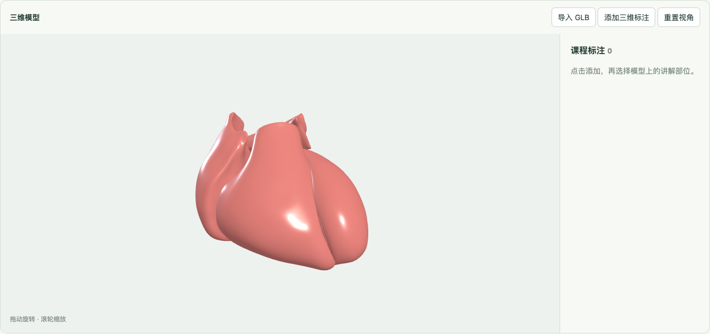
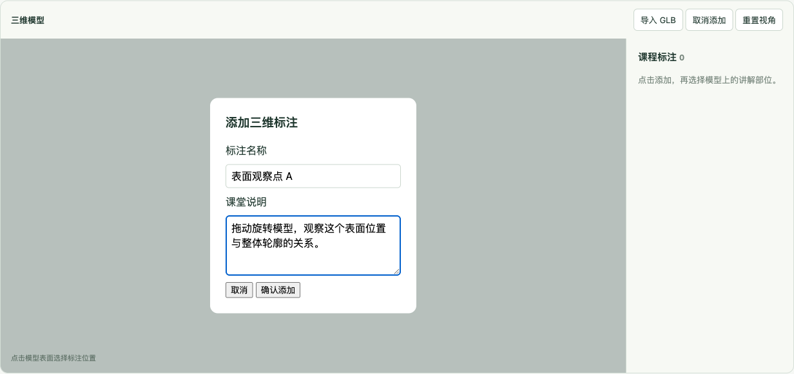
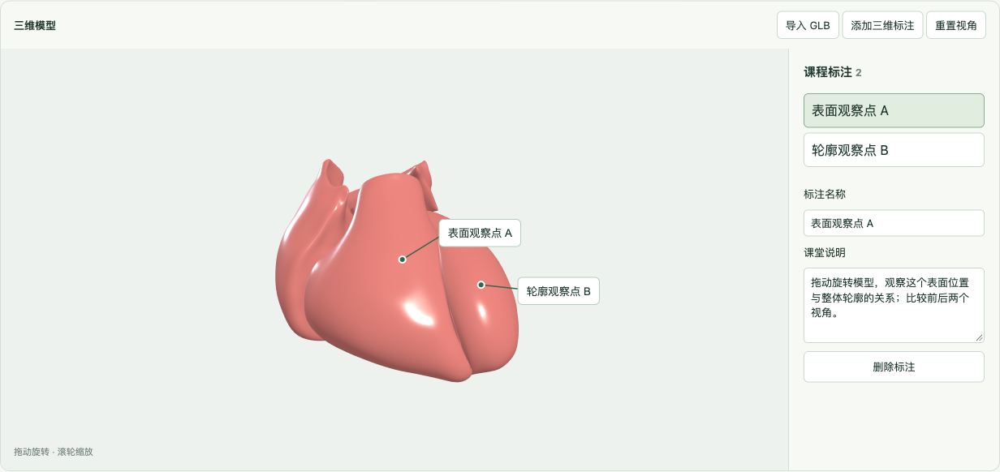
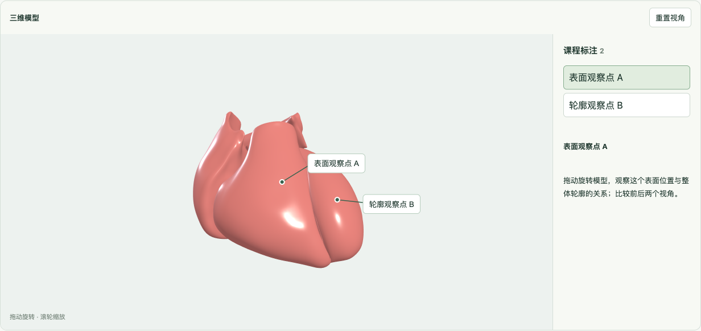
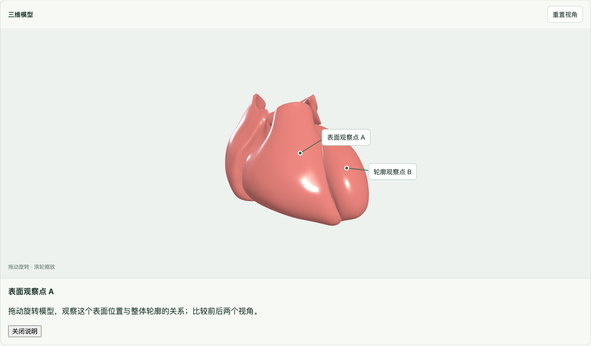
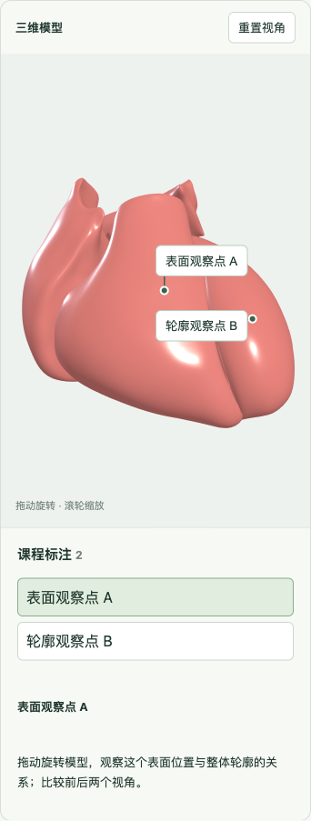

# 使用真实心脏参考模型体验教学标注

本教程使用仓库的 Vue 示例页面，依次体验模型加载、表面标注、侧栏编辑、JSON 恢复和课堂展示。把组件安装进自己的 Vue 项目时，请按 [README 接入说明](../README.md) 导入组件和 CSS，并绑定模型与标注。

截图中的课程参考模型为 **Kristen Browne; Heidi Schlehlein (2022). _3D Reference Organ for Heart, Male v1.2._ HuBMAP. [模型来源](https://doi.org/10.48539/HBM373.VSTV.568)，[CC BY 4.0](https://creativecommons.org/licenses/by/4.0/)**。仓库保留模型原始字节，仅修改文件名；来源、版本及校验信息见 [示例资产说明](../public/README.md)。截图和观察标注用于说明组件交互，不代表医学教材认证，课程内容需由课程作者审核。

## 1. 启动示例并加载课程模型

需要 Node.js 20.19+、npm 和支持 WebGL 2 的现代浏览器。在仓库根目录运行：

```bash
npm ci
npm run dev
```

打开终端打印的地址。页面默认加载原创心脏**示意模型**；点击页面顶部的“加载真实心脏模型”，切换到本教程使用的参考模型。等待“正在加载模型…”消失，“添加三维标注”变为可用。

该按钮等价于使用以下模型输入：

```ts
const model = {
  id: 'hra-heart-male-v1.2',
  source: '/models/hra-heart-male-v1.2.glb'
};
```

文件位于 `public/models/hra-heart-male-v1.2.glb`。也可以填写页面的“模型 URL”和“稳定模型 ID”，再点击“加载 URL”；使用本教程的标注数据时，请保持上述 ID。组件自动完整取景，可拖动画布旋转、滚轮缩放，点击“重置视角”回到完整观察视角。



## 2. 在模型表面创建观察标注

保持“课堂展示模式”未勾选、“显示标注侧栏”已勾选。

1. 点击“添加三维标注”，画布提示变为“点击模型表面选择标注位置”。
2. 点击一个希望讲解的可见表面，打开填写表单。旋转拖动和点击模型外的空白不会创建标注。
3. 将“标注名称”填写为“表面观察点 A”，在“课堂说明”填写“拖动旋转模型，观察这个表面位置与整体轮廓的关系。”
4. 点击“确认添加”。也可点击“取消”，或在表单中按 Escape 取消本次创建。

确认后，三维锚点、引线和文字出现在模型旁，侧栏增加一个条目。文字保持正向，锚点关联原来的表面位置。旋转到被模型遮挡的一侧时，标签默认隐藏；页面的“遮挡标注”可切换为“淡化”，便于观察遮挡效果。



## 3. 定位、编辑和保存标注

点击侧栏里的标注条目，定位到对应部位。选中后，可以直接修改侧栏中的“标注名称”和“课堂说明”，修改会通过 `v-model:annotations` 返回示例宿主。点击“删除标注”会删除当前选中条目。



页面提供两个用于体验宿主存储的按钮：

- “保存 JSON”：把**当前标注数组**写入下方“标注 JSON”文本框；不会下载文件或自动保存到浏览器。
- “恢复 JSON”：用文本框里的数组替换当前标注集合。可以先保存，再删除一个条目，最后恢复，检查标注是否重新出现。

要跨刷新保存，请复制文本框内容到自己的文件或存储系统。该示例保存的是标注数组，不包含模型文件或模型来源；正式课程存档还需要保存稳定模型 ID 和可重新访问的 URL，见 [README 保存与恢复](../README.md#保存与恢复)。

### 恢复仓库中的两条观察标注

[示例标注数组](../public/lessons/hra-heart-annotations.json) 位于 `public/lessons/hra-heart-annotations.json`，由真实组件界面的表面点击生成。

1. 先点击“加载真实心脏模型”，等待加载完成，确保当前模型 ID 为 `hra-heart-male-v1.2`。
2. 在新标签页打开同一开发服务的 `/lessons/hra-heart-annotations.json`，复制**完整 JSON 数组**，包括最外层的 `[` 和 `]`。
3. 回到示例，将数组粘贴到“标注 JSON”文本框，点击“恢复 JSON”。
4. 侧栏出现两条观察标注；逐条点击定位，查看对应表面和说明。

恢复会替换现有标注，请先复制保存自己的内容。页面没有专门的预设课程加载按钮，这一步使用现有的 JSON 恢复入口。若显示 `invalid-annotations`，检查是否加载了对应模型、使用原稳定 ID，以及数组是否完整。

## 4. 切换为课堂展示

勾选页面的“课堂展示模式”。组件保留旋转、缩放、重置和标注选择，隐藏导入、创建、修改和删除操作。点击侧栏条目可定位，选中说明以文本展示。

切换模式会取消未完成的标注创建。展示模式约束组件内部操作；宿主仍可通过公开输入更换模型或更新标注。再次取消勾选可返回编辑状态。



## 5. 隐藏侧栏并嵌入自己的布局

取消勾选“显示标注侧栏”，对应组件输入 `:show-sidebar="false"`。点击画布里的标注文字，下方会显示名称和课堂说明，点击“关闭说明”清空选择。

编辑模式下仍可导入和创建标注，但组件自己的修改、删除和条目定位入口在侧栏中。需要这些操作时可重新显示侧栏，或由宿主提供编辑界面并更新 `annotations`；宿主也可通过组件 ref 调用 `focusAnnotation(id)` 定位。



## 6. 检查 390px 窄屏布局

使用浏览器开发者工具将视口宽度设为 390px，或把组件放进窄的宿主容器。截图中的示例页面左右各留 24px，组件实际宽度为 342px。重新勾选“显示标注侧栏”，侧栏会排到画布下方。可依次尝试创建、选择、编辑和课堂展示，检查宿主页面是否为画布及表单留出合适的空间。

画布支持触屏观察操作。下面的窄屏截图展示布局效果；它本身不代表已覆盖所有移动设备和浏览器的交互验收。



## 模型身份与锚点恢复

每条标注保存 `modelId`、确定性 `nodePath`、网格局部坐标和局部法向量。请使用组件点击创建的锚点数据；不要根据截图或模型节点名称手写坐标。

同一模型仅更换下载地址时，保留 `model.id`，可继续恢复原标注。模型的几何、节点结构或导出版本发生变化时，需要新的 ID；组件不会迁移不同模型版本的锚点。跨模型或路径无效的数据会被忽略并报告 `invalid-annotations`。

“导入 GLB”每次选择本地文件都会生成**新的模型 ID**，并清空当前标注。因此，即使选择的是同一个文件，也不能直接用此前课程数组恢复。要恢复对应本地文件的旧标注，需要宿主通过公开输入提供该 `File` 和原模型 ID；该文件必须仍与原模型结构一致。`File` 无法通过 JSON 序列化后重载，长期存储应由宿主上传文件并保存 URL，或在恢复时要求重新选择文件。
